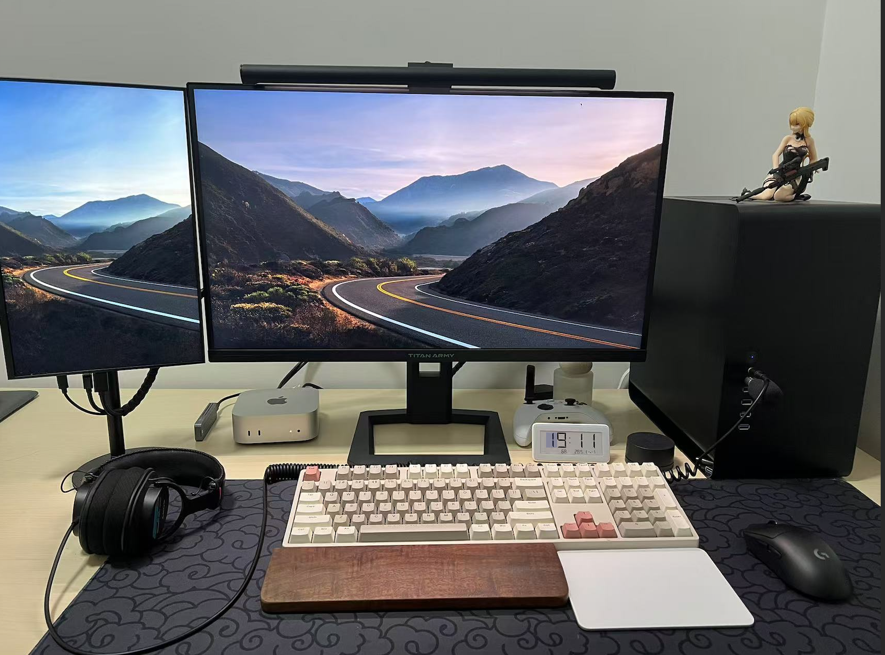
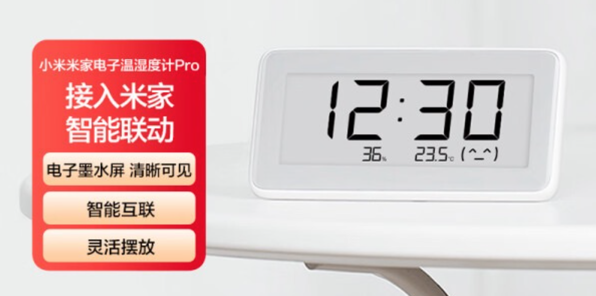

# 桌面时钟产品选择：我的体验与分析

## 1. 我为什么需要桌面时钟

在生活中，时间是很重要的，不管是过去、现在还是未来。

* 虽然现代操作系统的任务栏都会默认显示当前时间，但在某些方面还是存在一些不足。
  * 当任务栏设置了自动隐藏后（我也会为了更专注在某个件事上开启任务栏的自动隐藏），查看时间就需要额外的操作
  * 玩游戏或者看视频等全屏任务时，也无法看到时间
* 手表或者手机查看时间也是需要额外的精力，对比桌面时钟只需要眼神瞟一眼，抬手腕，点手机屏幕等操作显得还不够优雅。

所以，我希望找到一款专门的桌面时钟产品，能够更直观、便捷地展示时间，能让我随时知道当前的时间，同时又避免分心。

在选择产品时，我个人任务几个关键因素。

* 是否需要额外的电源
* 续航
* 时间准确度
* 价格
* 美观

## 2. 我的方案：米家电子温湿度计 Pro

找来找去，最后我选择了“米家电子温湿度计 Pro”作为我的桌面时钟。虽然它的主要功能是监测温湿度，但把它作为我的桌面时钟意外的很符合我的需求。

### 优点

* **无需接电源**：接电源就要一根额外的线，桌面会显得混乱，它使用的是 2 颗`纽扣电池` CR2032。
* **长续航**：电子水墨屏和低刷新率，电池可以用半年以上。
* **长时间使用准确度**：准确度一般，使用几个月后可能会误差 1-2 分钟，但是可以方便`手机蓝牙校准时间`，这也是我考虑它的一个很重要的原因，不然几个月就要手动校一次时间会很麻烦。所以我家里的挂钟使用的是*电波校时*（后来发现，只有窗户旁边才能收到电波，所以每几个月我就会拿到窗户放一晚，第二天时间就校准了
* **价格**：¥ 99，如果单纯展示时间就有点贵了，带了温湿度传感器并且能和米家联动我就觉得性价比好不错。
* **美观**：算简洁，不过和我桌面不是很搭，没有苹果产品的那种极致简洁的感觉

### 不足

* **没有日期**：没有展示日期和星期，如果有的话会更加分
* **不够美观**：时间字体以及产品外观不够美观
* **没有提醒功能**：虽然这个对我来说不是很重要，但是如果有类似番茄时钟，我也许会用得上。

## 3. 其他方案分析

其他方案我都考虑过，主要都有一些痛点，具体内容后面再补中吧

<!--TODO: 1. 补充方案细节 2. 放一些 up 主的桌面时间方案-->

* 方案一：**智能桌面时钟** (带智能音箱之类的)
  大部分都需要接电源
* 方案二：**[新/旧]手机当作桌面时钟**
  需要充电，使用和作时钟来回切换
* 方案三：**非智能的桌面时钟**
  隔一段时间就需要手动校准时间，可能会有一些非常准确的时钟，一年才需要校准一次，我猜测价格应该也会比较高
* 方案四：电波校时的桌面时钟，

## 4. 总结

在选择桌面时钟产品时，考虑自己的需求和使用场景至关重要。虽然“米家电子温湿度计 Pro”和我个人的需求比较匹配，但美观上，时间准确度不够理想，并且缺少倒计时、提醒等功能。其他方案也各有优缺点，最终选择应根据个人的使用习惯和偏好来决定。

如果和我有类似的看法，米家电子温湿度计 Pro 是一个不错的选择。
[【京东】小米米家电子温湿度计 Pro 到手价：¥99.00 购买链接：https://u.jd.com/IDRPVNV](https://u.jd.com/IDRPVNV)

希望我的分享能为你们的选择提供一些参考，帮助你找到最适合自己的桌面时钟产品！

## 变更日志

* `2024.11.14` 创建文章
